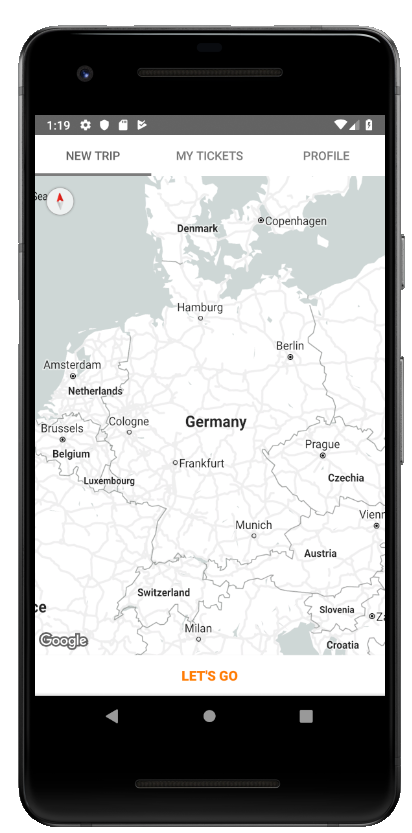
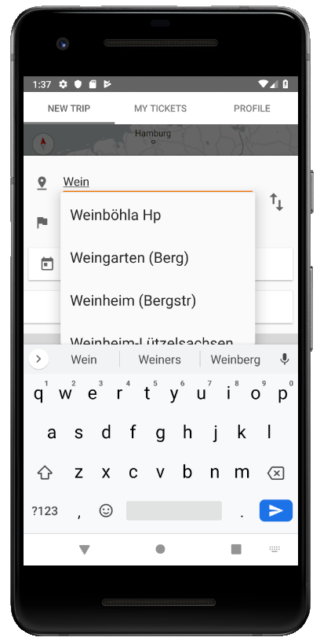
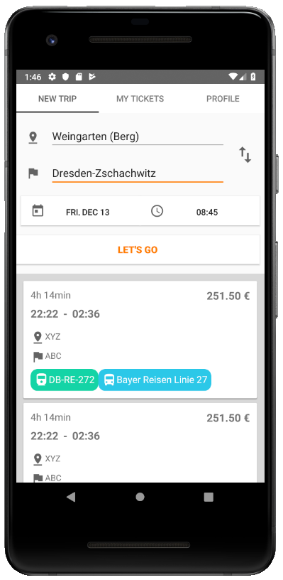
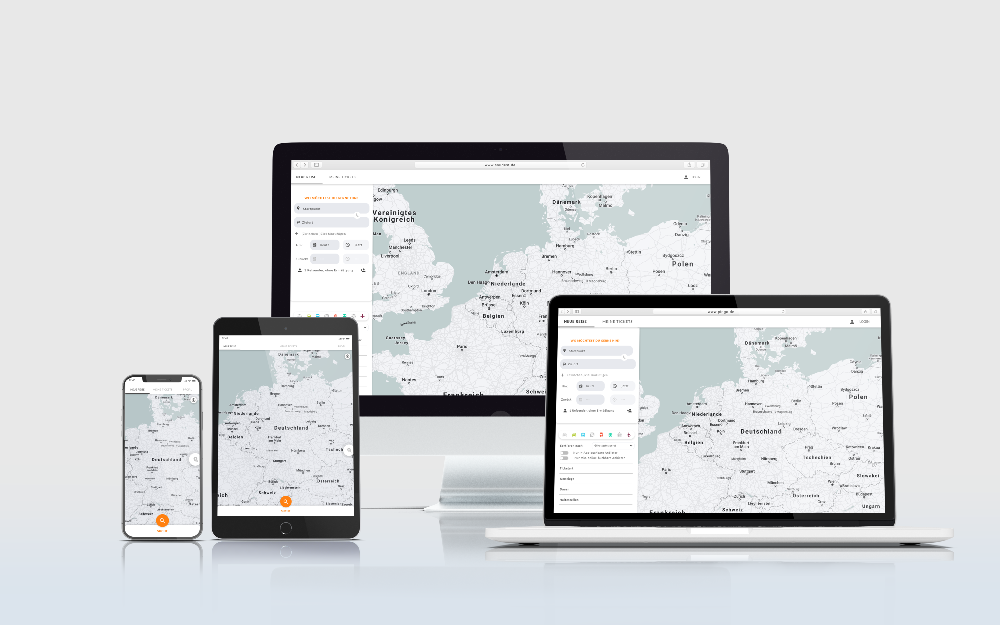
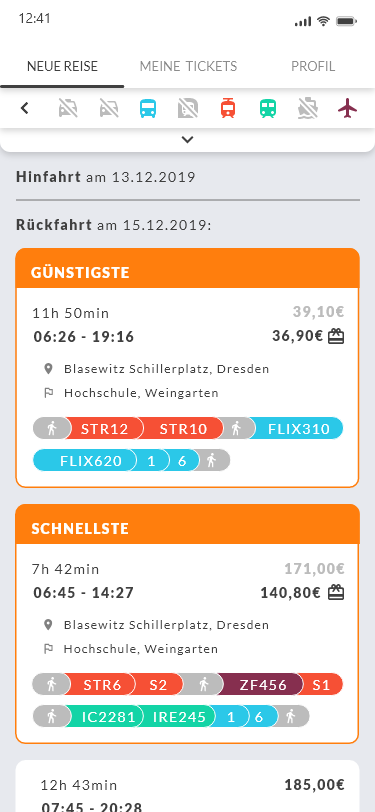
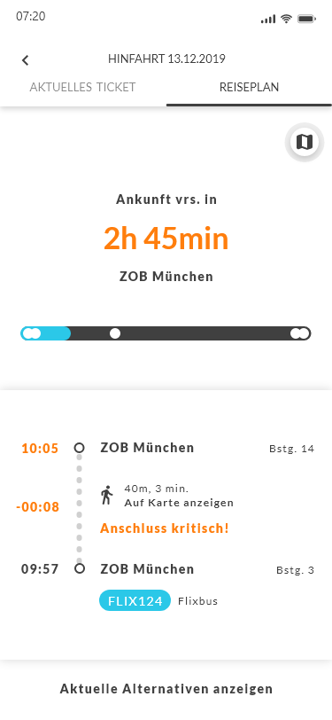
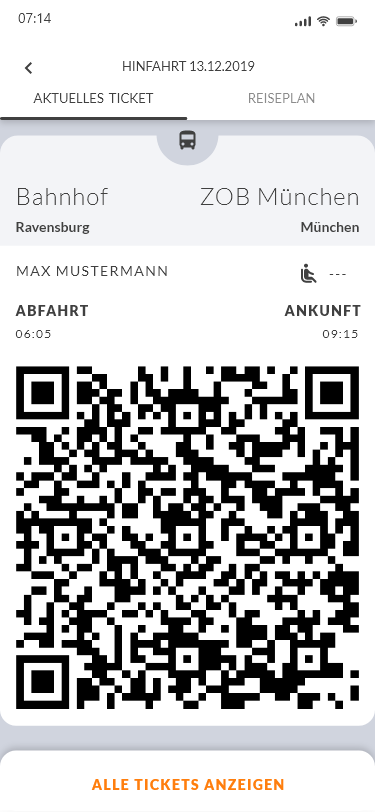

<!--
*** Thanks for checking out the Best-README-Template. If you have a suggestion
*** that would make this better, please fork the repo and create a pull request
*** or simply open an issue with the tag "enhancement".
*** Thanks again! Now go create something AMAZING! :D
***
***
***
*** To avoid retyping too much info. Do a search and replace for the following:
*** TomSeestern, SouDest Mobile App, @TomSegbers, hello@tomsegbers.de, SouDest, "MVP" Mobile Java App for our Project "SouDest"
-->


<!-- PROJECT SHIELDS -->
<!--
*** I'm using markdown "reference style" links for readability.
*** Reference links are enclosed in brackets [ ] instead of parentheses ( ).
*** See the bottom of this document for the declaration of the reference variables
*** for contributors-url, forks-url, etc. This is an optional, concise syntax you may use.
*** https://www.markdownguide.org/basic-syntax/#reference-style-links
-->
[![Contributors][contributors-shield]][contributors-url] [![Issues][issues-shield]][issues-url] [![MIT License][license-shield]][license-url] [![LinkedIn][linkedin-shield]][linkedin-url]
<!--
[![Forks][forks-shield]][forks-url]
[![Stargazers][stars-shield]][stars-url]
-->


<!-- PROJECT LOGO -->
<br />
<p align="center">
  <a href="https://github.com/TomSeestern/SouDest">
    
  </a>

  <h3 align="center">SouDest</h3>

  <p align="center">
    "MVP" Mobile Java App for our Project "SouDest"
    <br />
    <a href="https://github.com/TomSeestern/SouDest"><strong>Explore the docs »</strong></a>
    <br />
    <br />
    <a href="#apk">View Demo</a>
    ·
    <a href="https://github.com/TomSeestern/SouDest/issues">Report Bug</a>
    ·
    <a href="https://github.com/TomSeestern/SouDest/issues">Request Feature</a>
  </p>
</p>

<p float="left">
  
  
  
</p>

# Hard Facts
- Project @ [RWU for "Mobile Applications"](https://www.rwu.de/studieren/studiengaenge/angewandte-informatik)
- ~30 Hours work


<!-- TABLE OF CONTENTS -->
<details open="open">
  <summary><h2 style="display: inline-block">Table of Contents</h2></summary>
  <ol>
    <li>
      <a href="#about-the-project">About The Project</a>
      <ul>
        <li><a href="#built-with">Built With</a></li>
      </ul>
    </li>
    <li>
      <a href="#getting-started">Getting Started</a>
      <ul>
        <li><a href="#prerequisites">Prerequisites</a></li>
        <li><a href="#installation">Installation</a></li>
      </ul>
    </li>
    <li><a href="#usage">Usage</a></li>
    <li><a href="#license">License</a></li>
    <li><a href="#contact">Contact</a></li>
    <li><a href="#acknowledgements">Acknowledgements</a></li>
  </ol>
</details>


<!-- ABOUT THE PROJECT -->
## About The Project



> SouDest is a all in one Travel Companion to book any Mobility Gadget from E-Scooters to private Planes.

 This is the Mobile application MVP.

### Original Designs
First Iteration of the Design:

<p float="left">
  
  
  
</p>

Designed by [Rebecca Otto @ byonddesign.de](https://byonddesign.de/)

### Built With

* [Java 11]()
* [Gradle]()

### Other Tools

* Git - Version management
* Figma - Design
* Android Studio - IDE

<!-- GETTING STARTED -->
## Getting Started

To build a local copy, follow these simple steps.

### Prerequisites

Make sure you have the Dependencies installed:
* Java >= 11.0
* Gradle >= 3.2.1

### Installation

1. Clone the repo
   ```sh
   git clone https://github.com/TomSeestern/SouDest.git
   ```
2. Build from source
   ```sh
   gradle build
   ```


<!-- USAGE EXAMPLES -->
## Usage

The resulting .apk from the build process can be installed on any Android Smartphone.


## Documents
For all other Documents please check the [doc](doc) Folder
### Pre-Project Pitch:
[Link to PDF](doc/preProjectPitch.pdf)
### Pre-Project Pitch:
[Link to PDF](doc/finalPresentation.pdf)
### Version 0 Android App (APK)
<a id="apk"></a>
[Link to .APK](doc/SouDestV1.apk)
<!-- LICENSE -->
## License
See `LICENSE` for more information.


<!-- CONTACT -->
## Contact

Tom Segbers - [@TomSegbers](https://twitter.com/@TomSegbers) - SouDest@tomsegbers.de

Project Link: [https://github.com/TomSeestern/SouDest](https://github.com/TomSeestern/SouDest)


<!-- ACKNOWLEDGEMENTS -->
## Acknowledgements

* [Rebecca Otto from byonddesign.de for awesome Design](https://byonddesign.de/)


<!-- MARKDOWN LINKS & IMAGES -->
<!-- https://www.markdownguide.org/basic-syntax/#reference-style-links -->
[contributors-shield]: https://img.shields.io/github/contributors/TomSeestern/SouDest.svg?style=for-the-badge
[contributors-url]: https://github.com/TomSeestern/SouDest/graphs/contributors
[forks-shield]: https://img.shields.io/github/forks/TomSeestern/SouDest.svg?style=for-the-badge
[forks-url]: https://github.com/TomSeestern/SouDest/network/members
[stars-shield]: https://img.shields.io/github/stars/TomSeestern/SouDest.svg?style=for-the-badge
[stars-url]: https://github.com/TomSeestern/SouDest/stargazers
[issues-shield]: https://img.shields.io/github/issues/TomSeestern/SouDest.svg?style=for-the-badge
[issues-url]: https://github.com/TomSeestern/SouDest/issues
[license-shield]: https://img.shields.io/github/license/TomSeestern/SouDest.svg?style=for-the-badge
[license-url]: https://github.com/TomSeestern/SouDest/blob/master/LICENSE.txt
[linkedin-shield]: https://img.shields.io/badge/-LinkedIn-black.svg?style=for-the-badge&logo=linkedin&colorB=555
[linkedin-url]: https://linkedin.com/in/TomSegbers
